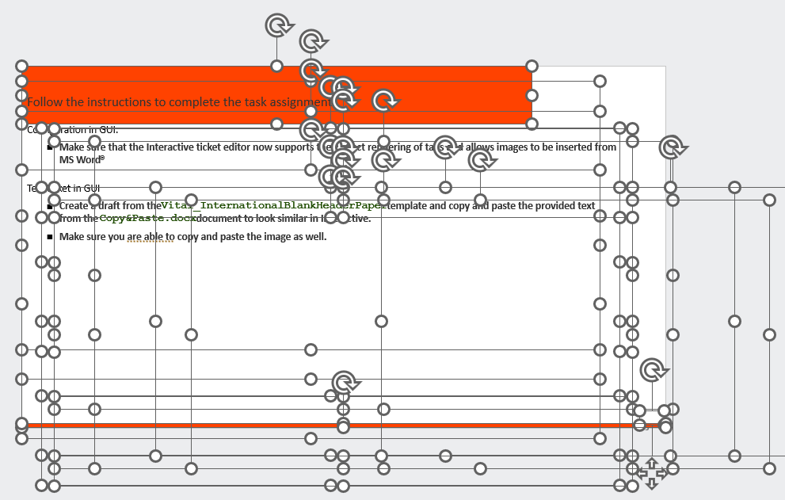

# fop-to-powerpoint-converter
An experimental PPTX producer from FOP intermediate format.

## The Goal
Implementing a single-source publishing paradigm for training purposes has a significant barrier. While you 
can author the content in some XML dialect and convert it into e-learning courses, web pages, or PDF files, 
it is still difficult to produce PowerPoint outputs. The most reliable is still PDF to PPTX conversion, 
utilizing Adobe Acrobat or Adobe online services.

To produce PPTX without intermediate PDF step we still need some paged source. The promising candidate was the 
FOP intermediate format (IF). It contains laid-out objects with the final size and coords which could be then 
translated into PPTX objects. 

## The Result
In this experiment, only a limited subset of the FOP IF dialect is processed. It was quickly apparent
while we can reach visually close outputs, it is useless for further editing as the text is split into 
separate lines, which are split further into smaller chunks if inline styles are applied (bold, emphasis, 
code).

